# Visualisation ideas for the thesis results

Eleven figure mock-ups for the three models in
`Documents/supervisor_model_brief.pdf`: one shared scenario figure, three per
model, and one comparison figure.

**All numbers are invented.** These are layouts, not results. Each figure carries
a grey footnote saying so. Sized for the brief's A4 text width (6.3 in).

---

## Shared

### 01 — Scenario geometry

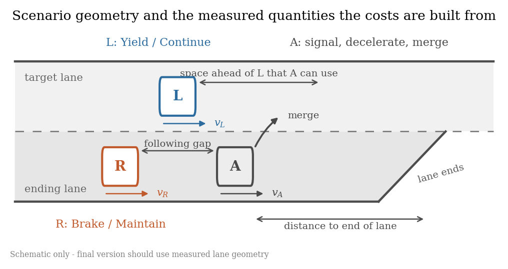

Names every quantity the costs are built from. Forces the gap definitions to be
fixed before anything is computed.

---

## Model 1 — game-theoretic decision model

### 02 — Sequential structure

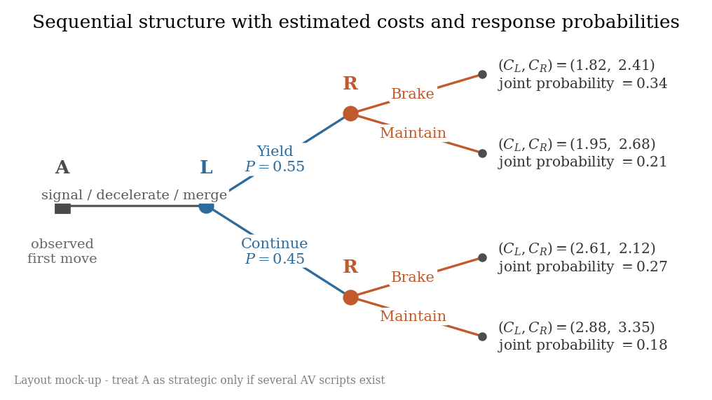

The game tree with fitted costs at the leaves and probabilities on the edges.
Shows the model is a game, not a regression.

### 03 — Cost decomposition

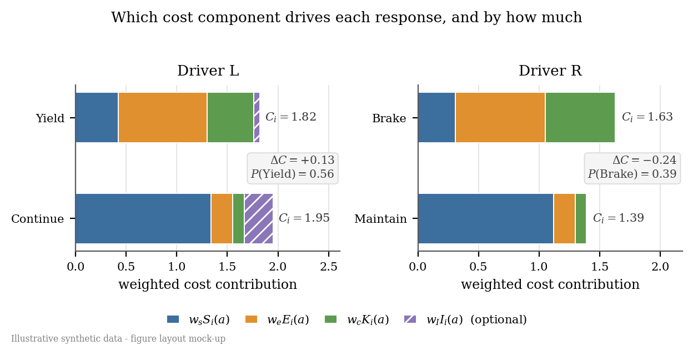

Each action's cost split into its weighted components, so the reader sees *why*
one action wins. The optional interaction term is hatched, and sits at zero for
R — how a dropped term should look.

### 04 — Decision map

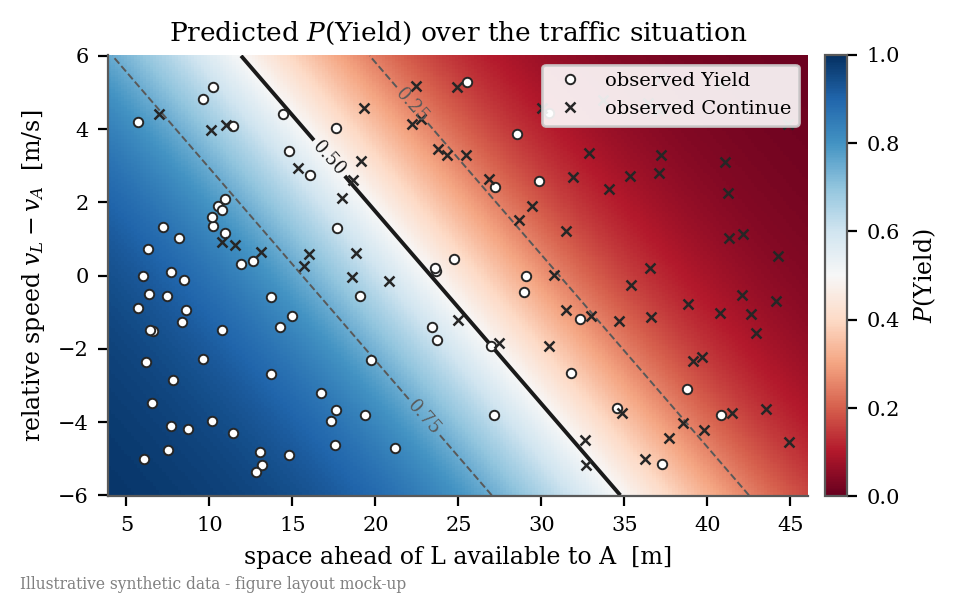

Predicted P(Yield) over two kinematic variables with the observed choices on
top. Agreement shows as circles clustering in the blue region.

---

## Model 2 — Hidden Markov Model

### 05 — Phase transitions

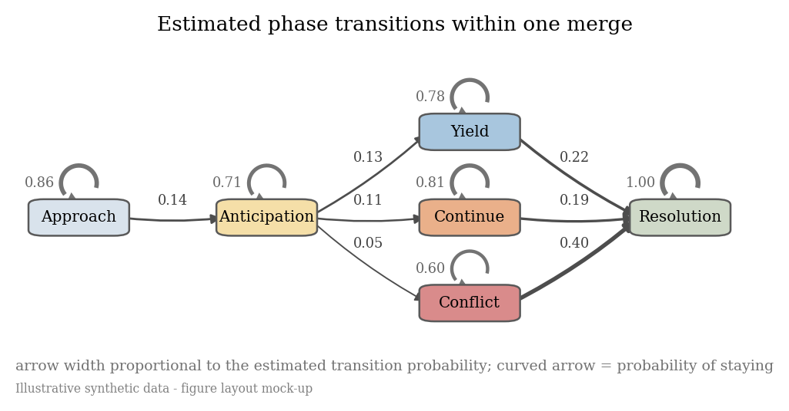

Arrow width is the transition probability; the curved arrow is the probability
of staying in a phase.

### 06 — One trial

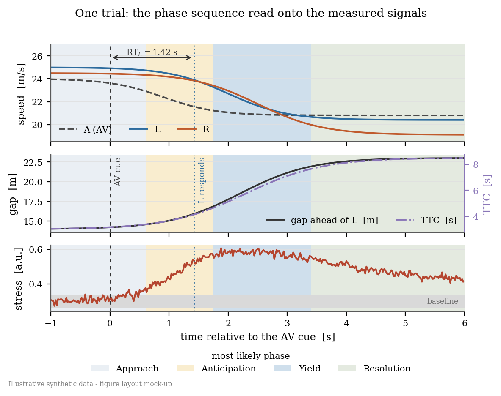

Phase shading behind the measured signals, aligned to the AV cue, with reaction
time marked. The figure that shows the phases correspond to something visible.

### 07 — Phases across trials

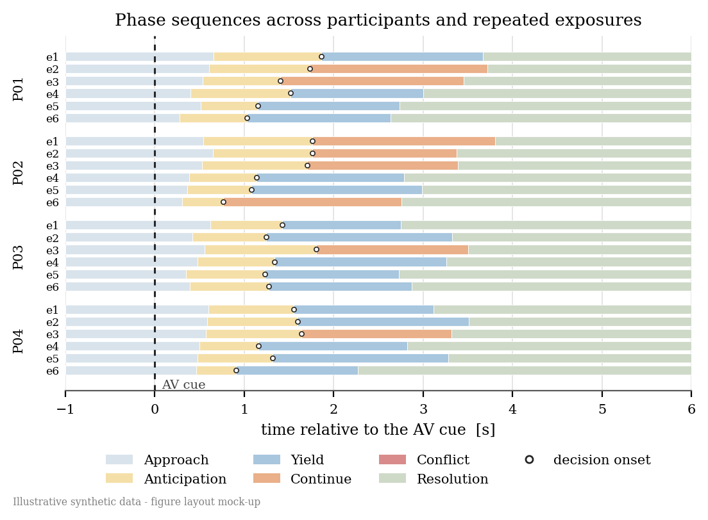

One row per trial, grouped by participant. If anticipation shortens with
exposure, the yellow band narrows down each block.

---

## Model 3 — latent stress-adaptation model

### 08 — Profile flow

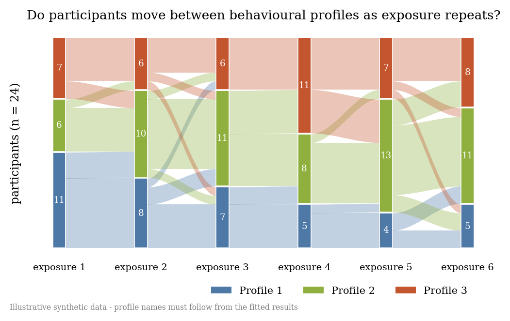

Participants moving between profiles across exposures. Persistence shows as
straight bands, adaptation as crossing ribbons.

### 09 — What the profiles mean

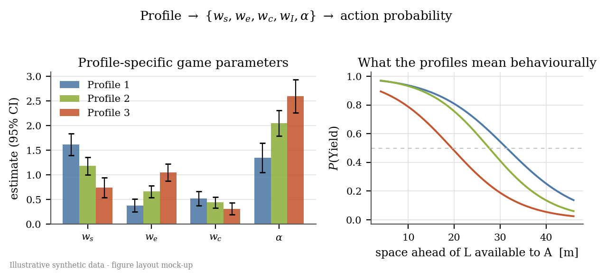

Cost weights and α per profile, next to the yielding curves they produce. The
right panel is the important half — parameter values alone say nothing.

### 10 — Reaction time

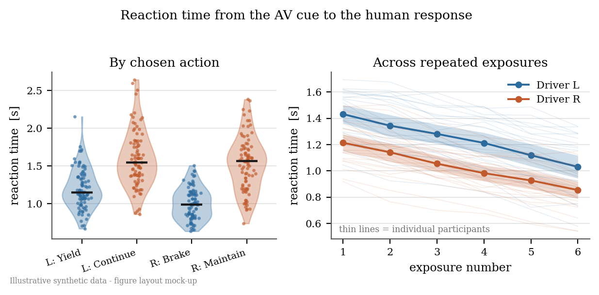

Reaction time by chosen action, and across exposures with individual
participants faint behind the group mean.

---

## Comparison

### 11 — Model progression

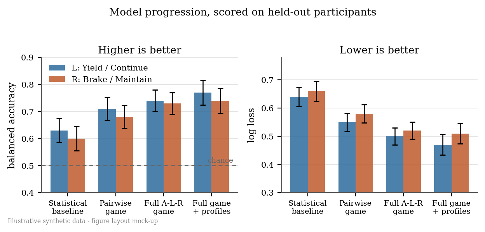

Baseline → pairwise game → full game → full game with profiles, scored on
held-out participants. Error bars must come from the participant splits.

---

## Notes

Build order if time is short: **03**, **04**, **08**, **11**. Figures **01** and
**02** can be finalised now, since they need no fitted results.

Precedents in `Papers/`: Mohammadi et al. (2025) Fig. 4 for figure 04;
Smirnov et al. (2021) Fig. 1 and Yao & Du (2022) Fig. 2 for figures 01–02;
Wei et al. (2013) Fig. 8 for figure 06; Stange, Kühn et al. (2022) Figs. 4–8 for
figure 10. Two departures worth knowing: none of these papers plots individual
participants (figure 10 does) or reaction-time distributions, and Stange's
"repeated interactions" are condition levels rather than repeated trials.
